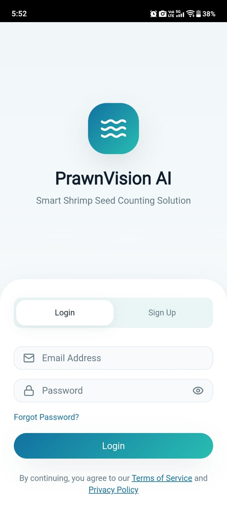
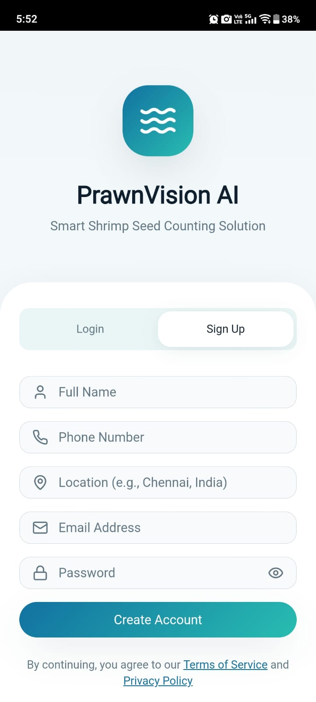
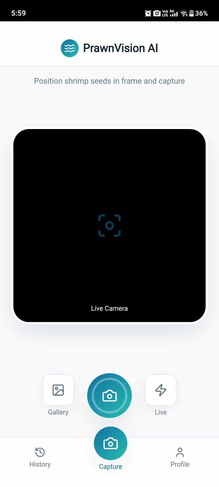
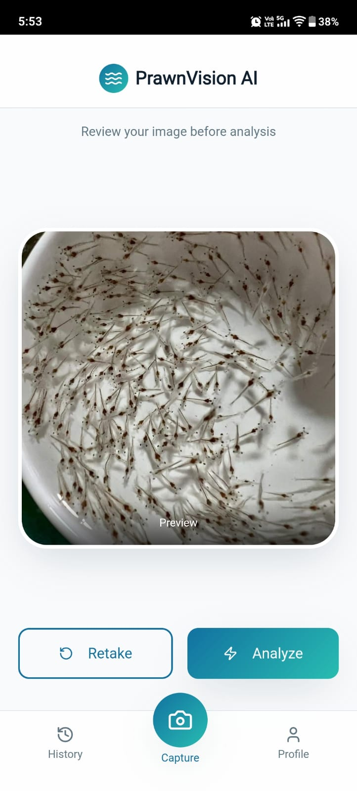
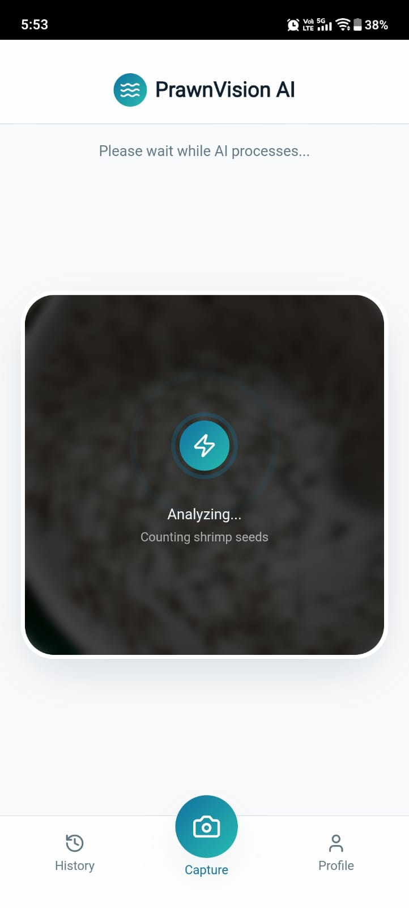
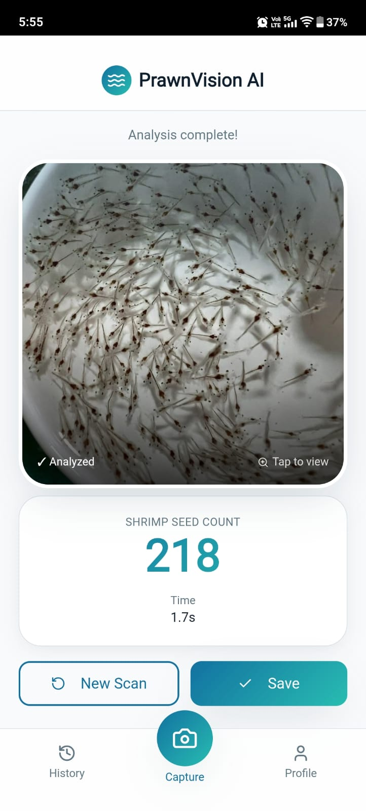
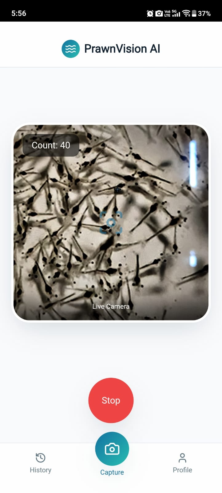
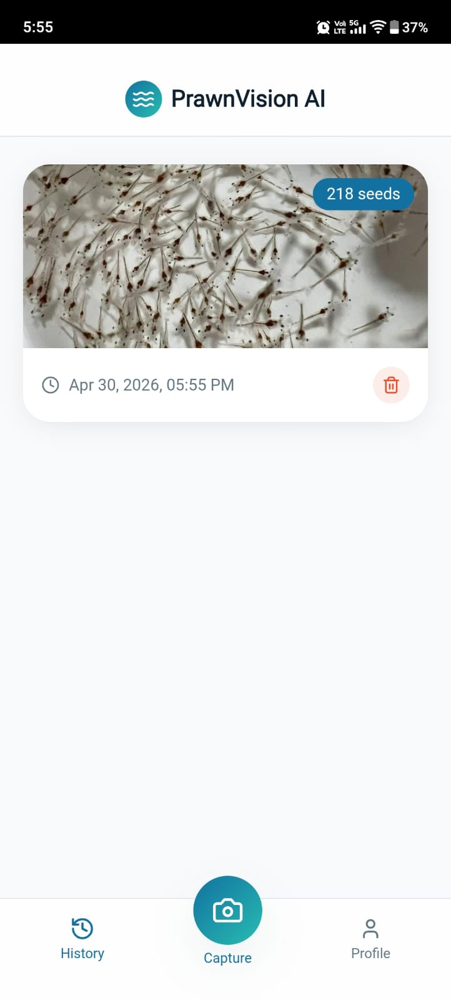
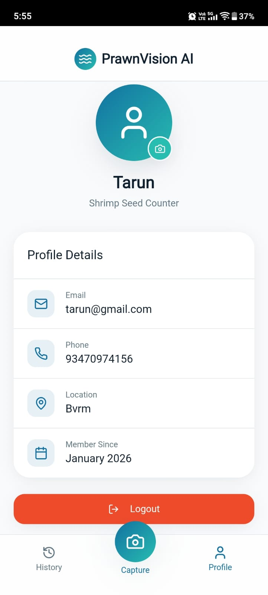

### 🔹 Title

### PrawnVision AI – Shrimp Seed Counting System

A React-based web and mobile interface for shrimp seed detection using AI.
Supports image upload, live camera detection, and real-time results.

### 🚀 Features

- 📷 Capture shrimp images using camera
- ⚡ Live detection (real-time counting)
- 🧠 AI-powered shrimp seed detection
- 🔐 User authentication (login/signup)
- 📱 Mobile app support (APK via Capacitor)
- 💾 Local history storage

### 🛠️ Tech Stack

- React + TypeScript
- Vite
- Tailwind CSS
- Capacitor (for APK)
- FastAPI

 ### 🔗 Backend

Connected to FastAPI backend deployed on Hugging Face:

Base URL:
https://tarun666-prawnvision-yolo-api.hf.space

### 📱 Download APK

👉 [Download APK](https://github.com/Tarun-Dev-6/PrawnVision-AI-Frontend/releases/tag/v1.0/Prawnvision.AI.apk)

Install the app on your Android device to use live detection.

### How to Use the App

### 1️⃣ Login / Signup
- Open the app
- Enter your email and password
- If new user, switch to signup and create account

### 2️⃣ Open Camera
- After login, go to capture screen
- Allow camera permission

### 3️⃣ Capture Image
- Position shrimp seeds inside frame
- Tap capture button

### 4️⃣ Analyze Image
- Click "Analyze"
- AI will process the image

### 5️⃣ View Result
- App shows shrimp count
- Confidence and processing time displayed

### 6️⃣ Live Detection (Optional)
- Tap "Live"
- Real-time shrimp counting will start

### 7️⃣ Save to History
- Click "Save"
- Image and count stored locally

### 8️⃣ View History
- Navigate to history page
- View previous detections

### 8️⃣ Profile Page
- View the details of user
- logout option

### 🔁 App Flow

Login → Capture Image → AI Detection → View Results → Save History

### 🚀 Future Improvements

- Cloud storage for dataset
- Model retraining pipeline
- Admin dashboard
- JWT-based authentication
- Batch Processing

